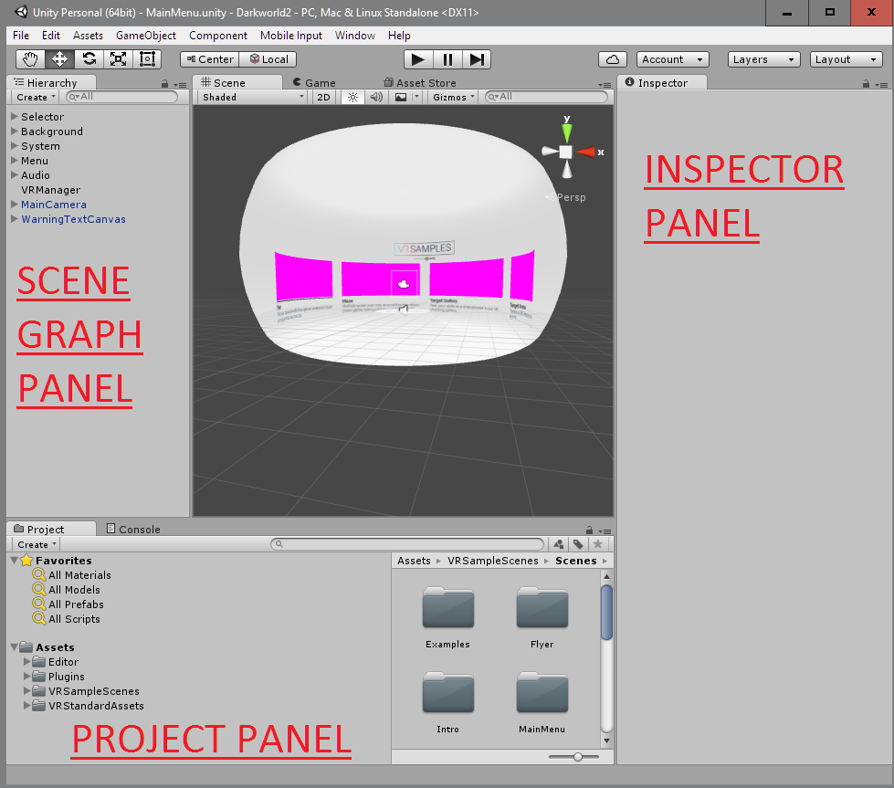
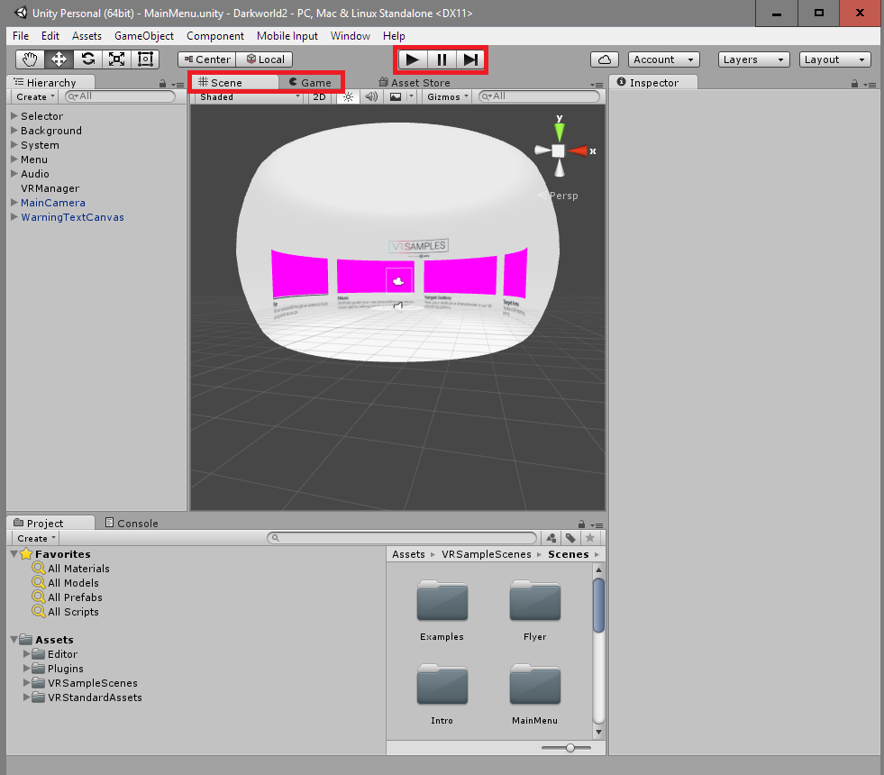
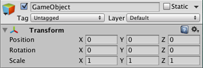
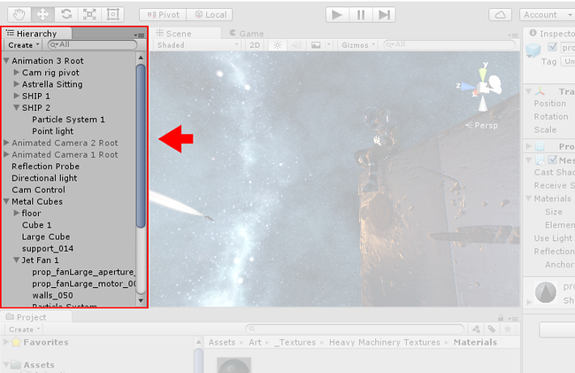

## Installing Unity

Download and install [Unity](https://store.unity.com/). The personal edition is enough to get started. You can install extras, but you will `Unity`, `Documentation`, `Standard Assets`, `Example Project`, and `Microsoft Visual Studio Tools for Unity`.

## Moving Around in 3D space

Unity uses the `WASD` keys to move around. This paradigm comes from first-person games.

- `W` is forward, `S` is backwards
- `A` is strafe left, `D` is strafe right,

You can also use your mouse to pan. Hold the middle mouse button (scroll wheel)
to pan the view. Scroll the wheel to zoom in and out.

## The Unity Coordinate System

Unity coordinate system is left-handed:

- `X` goes from left to right
- `Y` goes from down to up
- `Z` goes from out to in

# Unity Editor Panels

## Project

- Displays your project's folder as a literal representation of what is on the disk (if you erase something here it will erase it from your disk)
- If you import external packages they will be copied here into your project
- You should organize resource types in folders to make it easy to find files in your project
- The project view (and most other views) have a filter field that lets you search by name

## Inspector

- Shows details for objects you select on
- Displays the location and transform info for the object
- Lets you edit properties of scripts run on the object
- Some objects have default properties that you can change

## Console

- Shows outputs from your scripts
- Shows error messages when there are problems in the scene
- Shows important system level info from Unity

## Scene Graph Panel

- "Hierarchical tree" of the scene
- Allows you to set parent/child relationships between objects
- Parents pass transforms down to their children
- When a parent object becomes disabled, all children are also disabled
- Scripts do not run on disabled objects

> [info]
>
> Unity creates a .meta file with the same name as every asset in your project, this .meta file contains a unique GUID ID to identify your asset within the project file. This is what .meta files are for. Whenever you attach a script, it will attach to the object based on the .meta ID. If you ever want to see if an asset is in use in your project you can open the project file in a text editor and search for the GUID.

# Editor Modes

- `Play mode` - runs the game, nothing will save while in play mode, so you can tweak settings and delete or hide things to find bugs or test
- `Pause mode` - pause the execution while in play mode, useful for debugging problems
- `Step Next` - allows you to step to the next frame, useful for debugging

## Scene View

- Shows you the game in edit mode
- Allows you to select objects and change their properties
- You can go into Scene view while the game is running to analyze the playing field

## Game View

- This is how the game looks from the users perspective when it is running
- Nothing can be selected

# Components of a Scene

## Cameras

The main view Camera is called the Main Camera.

- You can add additional cameras and toggle between them, or do neat effects with multiple cameras like rendering to surfaces
- `FOV Field of View`: how tight or wide the cameras field of view is
- `Clipping Plane`: The clipping plane determines how far back the camera can see before it starts clipping objects

> [info]
> Each scene must have at least one camera!

## GameObjects

- A Game Object is anything in the Unity World that you can manipulate in 3D space. There are primitives and advanced Game Objects. You can also make blank empty game objects to parent other objects and help organize your scene.

### Manipulating GameObjects

Transforms and QWER to access different tools to manipulate objects

- **`Q` is the Pan Tool**, allows you to drag the viewport around
- **`W` is the translate tool**, allows you to move objects around in the world
- **`E` is the scale tool**, allows you to change objects scale and size
- **`R` is the rotation tool**, allows you to rotate objects in 3D space

## Lights

- Every game must have at least one light, or you won't be able to see anything.
- You can have as many lights as you want, but they have a cost.
- There are four kinds of lights: `directional`, `point`, `spot`, and `area`.
    - `Directional lights` are global lights, they affect all objects.
    - `Point light` is a sphere of light at a specific location.
    - `Spot light` is a spotlight that points at a specific location.
    - `Area light` is defined by a rectangle in space.
- Real-time lighting is default, but it's computationally expensive. You can also use light maps to bake lighting into the scene for performance gains at the expense of memory. Baked light maps are static, and their objects cannot move.
- `Shadows` are also something that is expensive, there are different modes for shadows and shadow maps as well.
- You can import custom meshes into Unity. You can make these with external 3D asset programs or get them from the asset store.
- You can also animate meshes in interesting ways. You can import animations from other programs or use Unity’s key-frame editor to create your own animations

## Attaching Scripts

- You can drag and drop a script on an object to give it behavior or properties. This is called attaching a component.
- Unity has a component architecture, this means that you can attach many components to one object and they can all run together.
- You can make components depend on other components, but the best design is one in which each component does a separate job.

# Scenes

Each Unity Project consists of a project file, and one or more Scene
files.

A Scene is a logical breakdown of a specific scene or level of your
game.

You can use Scenes for a variety of purposes:

Scenes can be dynamically loaded from disk to lower the memory of your game.

Scenes can separate out your game levels

Scenes can separate out large systems and combined at runtime.

We can talk more about Scenes later, for now you must know what they are.

# Working with GameObjects

Every object in the world is considered a GameObject. These GameObjects make up the world.

Every GameObject has a Transform that describes the GameObjects position, scale, and rotation.

Your world contains a tree of objects called the **Scene Graph**. You can create your own little trees within this graph to organize your scene.

If you have a parent node, the children of this parent will inherit
transform information from the parent. This allows you to scale,
translate, and rotate groups of objects together.

You can also disable/enable a parent to disable/enable entire groups of
children. This is a useful way to show/hide UI windows, show/hide level
elements, or enable/disable game systems.

## Primitives

Primitives are the basic GameObjects avaliable in Unity.

- `Cube`
- `Sphere`
- `Cylinder`
- `Plane`
- `Quad`
- `Terrain`

## Meshes

Mesh files can be imported from external 3D programs. You can use Blender, Maya, 3DStudio Max, or generic OBJ exporters. Unity supports standard file formats.
