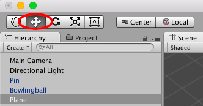

**Exercise One - Your first scene**

In this first hands on lab, we will be creating a simple bowling scene.
Nothing fancy here, just import and arrange 10 pins and a lane. The art
assets are available for you in the Bowling package under your course
materials directory. To start please import the starter bowling package
into Unity.

Here are the goals and purposes of this exercise:

1 - Become familiar with world navigation and object manipulation within Unity3d.

2 - Learn how to import assets into your project.

3 - Learn how to find objects in the Hierarchy panel.

4 - Learn how to set the transforms of objects in the inspector panel.

5 - Learn how to use the Rotate, Scale, and Translate tools to move your objects around the world.

6 - Import your assets, and locate them in the Project Window. Once located drag BowlingPin and BowlingBall onto the main viewport to put them into your scene. You can type in the filter box at the top of the project window if you want to search.

7 - You should notice that you now have some new objects in your Hierarchy view. You should be able to click them in this view to select them in the scene viewport, and double click one of them to jump to the object in the world.

8 - Please select GameObject-&gt;3D Object-&gt;Plane from the top menu, you should then have a Plane in the hierarchy view.

9 - Now select the Plane and look for the Inspector Panel, at the top of the inspector you should see Transform. Change the position to X:0 Y:0 Z:0 so everything is in the middle of your scene. Do the same for the bowling pin, and bowling ball. Then double click the Plane again to jump to its position.

10 - Now things will get fun, you can navigate around the world space by using your mouse and keyboard together. Click on the viewport and then put your left hand on the WASD keys on the keyboard, and your right hand on the mouse (of course flip them if you are left handed). Hold down the right mouse button on the viewport and use W to move forward in the world, and S to move backwards. You can strafe left and right with A and D respectively. Try moving in all four directions then go to the next step.

11 - The mouse lets you fly in all axis, continue to hold the right mouse button down and move the mouse on the viewport to change where you are looking. You can do this while holding down W or D to move around the 3d world. If you get lost, doubleclick the Bowling Lane again to center your view on it. Try this now.

12 - If you want to fly faster, hold shift while you press W A S or D. This will double your movement speed.

13 - You can select objects with the left mouse button. Click on an object to select it.

14 - You can also PAN the viewport up down left or right by holding middle mouse button and dragging. Try this now.

15 - Finally you can zoom in or out by scrolling the mouse wheel. Try this now.

16 - These are all of the things you need to navigate the world. Now we are going to start manipulating some objects. Please click on the Bowling Pin object. Once you have it selected press the W key as a shortcut for **translate** mode. When you press QWER or T without the right mouse button being held down it will change object manipulation modes. These modes are used to edit object transform information in 3d space. The most basic one is **translate**. Translation is when you move an object around in 3d space and change its location.

17 - Once you have the translate tool selected you will notice that some little blue, green, and red arrows appear over your object. These are the translation handles. You can drag on these handles to move the object around the world. Try clicking the red handle and moving your cursor back and forth, you will see that the X coordinate changes in the Inspector and the pin moves back and forth. You can use the other handles to move the pin in the other directions. Now you are going to use the handles to move the pin to the end of the lane just like in a real bowling game. Remember you can move around the world, and if you get lost double click the pin to recenter your viewport.

18 - Once your pin is at the end of your lane, we are going to copy and paste it to make more pins. We need 10 total. Click the pin in the world or hierarchy view then press Ctrl-C to copy and Ctrl-V to paste. You can do this several times to make several pins. Please align all of the pins just like you would see in a real bowling alley. You can hold the ctrl key (pc) or command(mac) while dragging to force the pins to snap to grid. To adjust the grid click Edit-&gt;Snap Settings and change the grid size. You can use half spacing to perfectly stagger the pins.

19 - Once you are finished you should have four nice rows of pins. Now let’s learn about object parenting. These pins are in your hierarchy view, but it is starting to get cluttered and messy. Imagine a game with hundreds of objects, it would get out of hand quickly. This is why we create little tree structures in the scene graph that we can expand and collapse. Double click your front pin to center your world viewport on the pin. Then click the GameObject menu at the top of the screen and click Create Empty. This will put an empty GameObject into your world. We can use this as a container. Now select all of your pins using ctrl-click on each one in the hierarchy view. Once they are all selected drag them to the new GameObject to make them children of it.

20 - Now it is easy to move all of the pins around at one time or hide them. Lets hide them now. Click the new container game object you created and look at it in the inspector. It should just show Transform information, but at the top it also has a name. Change it’s name to Pin Group. After that uncheck the little checkbox to the left of the name. This will disable the game object and all of the pins should vanish from view. You will notice that the hierarchy item for Pin Group just went gray, as did all of its children. When a gameobject is disabled, it turns gray. The same is also true in other places you see a checkbox.  This is a very useful debugging tool to use while the game is running. You can always pause the game and disable/enable game objects to debug issues. You can re-enable the group now and we can move forward.  

21 - Now we should do something about this plane, it is way too small to be our lane. Let’s fix it, to do this we are going to use the **scale** transform. Click your plane to select it, then change the X property under scale to 8. This will stretch the plane as shown.

22 - Now position the pins at the end of the lane, and the bowling ball at the start of the lane, rotate the pins 90 degrees so that they face down lane.

23 - Now we are almost ready to test run our scene, but what about the camera? Double click your pin group to center your viewport on the pins. Now find a nice angle shot to look at the playing field, you can move around to find the right shot you want. Once you have it go to the next step.

24 - Select Main Camera in your hierarchy view and click the GameObject menu-&gt;Align With View. This will align the Camera with your viewport and make the camera see exactly what you are seeing. This is a very useful Unity feature and one of the best ways to align a camera in 3d space.

25 - Now click the Play button in the top center of the screen. Your world should run and you should see exactly what you saw on your viewport before, but notice that the selected tab below the play button changed from Scene to Game. Game is the running game, Scene is the editor. You can actually click Scene while the game is running to move things around and inspect objects. This is good for debugging and troubleshooting issues, but note that not all rendering effects and objects will render in Scene mode. Also remember that if you change things while in Play mode they will not save. This is by design, and it is very useful for testing out settings while the game is running with no fear at all that you are messing up your world. Congrats on making your first scene! This bowling game won’t actually do anything yet, but that’s ok. We will cover that in another tutorial.
