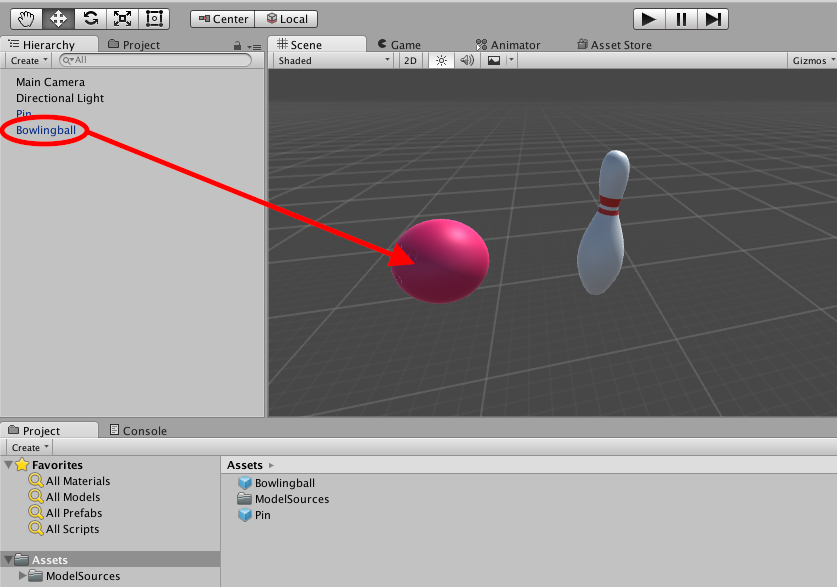
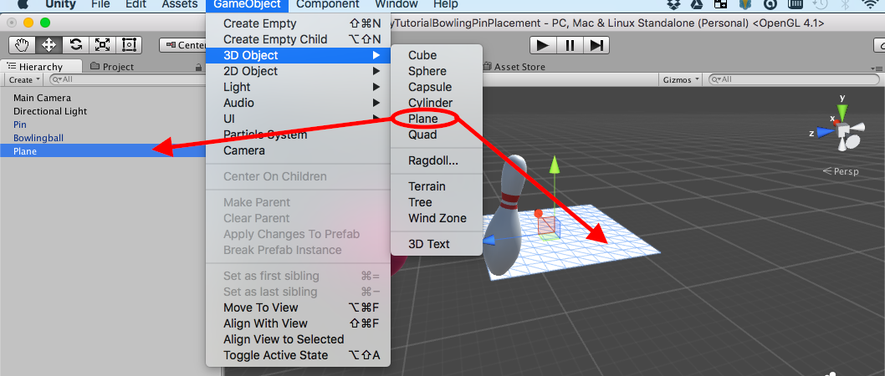
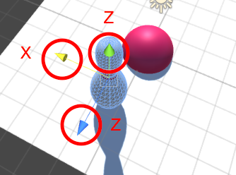
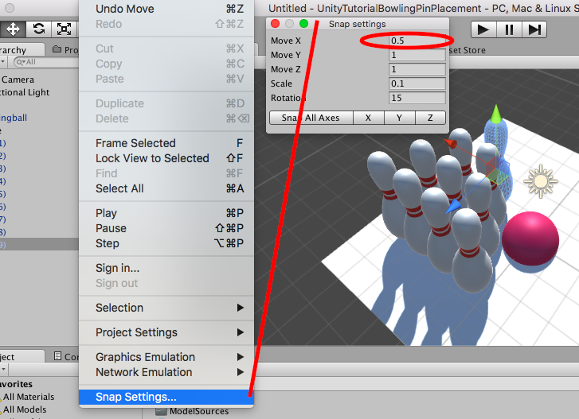
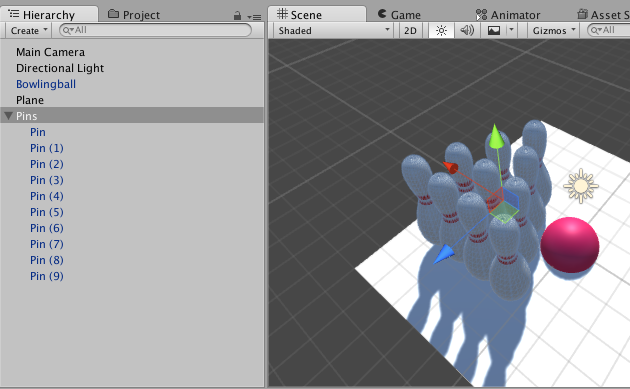
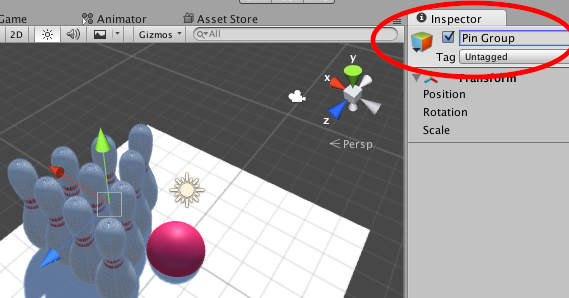
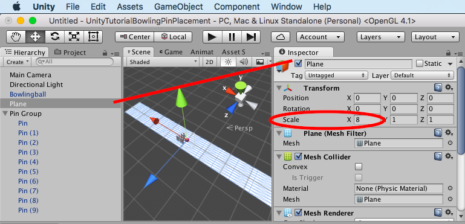
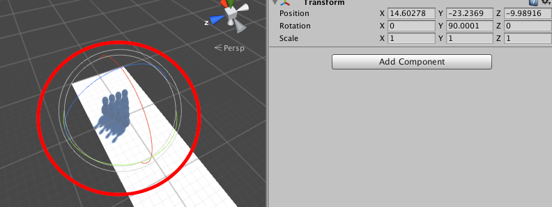

In this first hands on lab, we will be creating a simple bowling scene. Nothing fancy here, import and arrange 10 pins and a lane.

The goals and purposes of this exercise are to:

- Become familiar with world navigation and object manipulation within Unity.
- Learn how to import assets into your project.
- Learn how to find objects in the Hierarchy panel.
- Learn how to set the transforms of objects in the inspector panel.
- Learn how to use the Rotate, Scale, and Translate tools to move your objects around the world.

# Creating a project

<!-- TODO: Create a new project -->

The art assets are available for you in the Bowling package under your course materials directory. To start please import the starter bowling package into Unity.

# Adding some assets

Empty projects are boring. Let's add in some assets!

> [action]
>
1. Import your assets by dragging them into the project, and locate them in the Project Window. Once located drag BowlingPin and BowlingBall onto the main viewport to put them into your scene. You can type in the filter box at the top of the project window if you want to search. 
1. You should notice that you now have some new objects in your Hierarchy view. You should be able to click them in this view to select them in the scene viewport, and double-click on them to jump to the object in the world. 
1. Select `GameObject->3D Object->Plane` from the top menu, you should then have a `Plane` in the hierarchy view. 
1. Now select the `Plane` and look for the _Inspector Panel_, at the top of the inspector you should see `Transform`. Change the position to `X:0 Y:0 Z:0` so it's in the middle of your scene. Do the same for the bowling pin, and bowling ball. Double-click the `Plane` again to jump to its position. 

# Navigating through the scene

It's about to get fun! You can navigate around the world space by using your mouse and keyboard together.

> [action]
>
> ### Let's experiment with moving around!
>
1. Click on the viewport and then put your left hand on the WASD keys on the keyboard, and your right hand on the mouse (of course flip them if you are left handed). Hold down the right mouse button on the viewport and use `W` to move forward in the world, and `S` to move backwards. You can strafe left and right with `A` and `D` respectively. Try moving in all four directions then go to the next step.
1. The mouse lets you fly in all axis, continue to hold the right mouse button down and move the mouse on the viewport to change where you are looking. You can do this while holding down `W` or `D` to move around the 3D world. If you get lost, double-click the Bowling Lane again to center your view on it. Try this now.
1. If you want to fly faster, hold shift while you press `W` `A` `S` or `D`. This will double your movement speed.
1. You can select objects with the left mouse button. Click on an object to select it.
1. You can also PAN the viewport up down left or right by holding middle mouse button and dragging. Try this now.
1. You can zoom in or out by scrolling the mouse wheel. Try this now.

These are the tools you need to navigate the world. Play around with it a bit more and make sure you're comfortable navigating in Unity.

# Manipulating objects

Now that you know how to navigate the world, let's get our objects placed.

> [action]
>
1. Click on the `Bowling Pin` object. Once you have it selected press the `W` key as a shortcut for _translate_ mode. When you press `QWER` or `T` (without the right mouse button held down) it will change object _manipulation modes_. These modes edit object transforms in 3D space. The most basic one is _translate_. _Translation_ is when change an objects location by moving it around in 3D space. 
1. Once you have the _translate_ tool selected you will notice that little blue, green, and red arrows appear over your object. These are the translation handles. You can drag on these handles to move the object around the world. Try clicking the red handle and moving your cursor back and forth, you will see that the `X` coordinate changes in the Inspector and the pin moves back and forth. The other handles move the pin in the other directions. Use the handles to move the pin to the end of the lane like in a real bowling game. Remember you can move around the world, and if you get lost double-click the pin to recenter your viewport. 
1. Once your pin is at the end of your lane, we are going to copy and paste it to make more pins. We need 10 total. Click the pin in the world or hierarchy view then press Ctrl-C to copy and `Ctrl-V` to paste. You can do this more than once to make more pins. Align the pins like you would see in a real bowling alley. You can hold the ctrl key (pc) or command(mac) while dragging to force the pins to snap to grid. To adjust the grid click `Edit->Snap Settings` and change the grid size. Use half spacing to stagger the pins. 

# Object Parenting

You should have four nice rows of pins. Now let’s talk about object parenting. These pins are in your hierarchy view, but it's starting to get cluttered and messy. Imagine a game with hundreds of objects -- it becomes messy fast! This is why we create tree structures in the scene graph that we can expand and collapse.

> [action]
>
1. Double-click the front pin to center your world viewport on it. Then click the `GameObject` menu at the top of the screen and select `Create Empty`. This will put an empty `GameObject` into your world. We will use this as a container. Now select the pins using `ctrl-click` on each one in the _hierarchy view_. Once they are all selected drag them to the new GameObject to make them children of it. 
1. Now it's easy to move the pins around together or hide them. Lets hide them now. Click the new container game object you created and look at it in the inspector. It should show Transform information, but at the top it also has a name. Change it’s name to `Pin Group`.
1. Uncheck the little checkbox to the left of the name. This will disable the game object and the pins should vanish from view. You will notice that the hierarchy item for `Pin Group` turned gray, as did its children. When a `GameObject` is disabled, it turns gray. The same is also true in other places you see a checkbox.  This is a useful debugging tool to use while the game is running. You can always pause the game and disable/enable game objects to debug issues. Re-enable the group now and we can move forward. 

# Scaling

We should do something about this plane, it's way too small to be our lane! Let’s fix it with the _scale_ transform.

> [action]
>
1. Click your plane to select it, then change the `X` property under scale to `8`. This will stretch the plane as shown. 
1. Now position the pins at the end of the lane, and the bowling ball at the start of the lane. Rotate the pins `90 degrees` so that they face down lane. 
1. Now we are almost ready to test run our scene, but what about the camera? Double-click your pin group to center your viewport on the pins. Now find a nice angle shot to look at the playing field, you can move around to find the right shot you want.
1. Select Main Camera in your hierarchy view and click the `GameObject menu->Align With View`. This will align the Camera with your viewport and make the camera see what you are seeing. This is a useful Unity feature and one of the best ways to align a camera in 3D space. 
1. Let's test our scene! Click the `Play` button in the top center of the screen. Your world should run and you should see exactly what you saw on your viewport before.

<!--  -->

> [info]
>
> Notice that the selected tab below the play button changed from _Scene_ to _Game_. _Game_ is the running game, _Scene_ is the editor. You can actually click _Scene_ while the game is running to move objects around and inspect them. This is good for debugging and troubleshooting issues, but note that not all rendering effects and objects will render in Scene mode. Also remember that if you change settings while in _Play_ mode they will not save. This is by design, and it's useful for testing out settings while the game is running with no fear at all that you are messing up your world.

# Recap

Congrats on making your first scene! This bowling game won’t actually do anything yet, but that’s ok. We will cover that in another tutorial.

So far, you should have:

- Became familiar with world navigation and object manipulation within Unity.
- Learned how to import assets into your project.
- Learned how to find objects in the Hierarchy panel.
- Learned how to set the transforms of objects in the inspector panel.
- Learned how to use the Rotate, Scale, and Translate tools to move your objects around the world.
